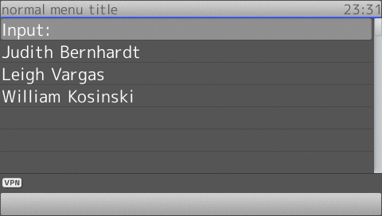

## InputField

!!! Demo
    [Try on your phone](xml/InputField.xml)

* It is recommended to set speedselect attribute to off in parent **Menu** to avoid the selection bar to jumping around when the user input the text.
* The input mode can be changed with long press ***** key.
* **InputField** can have one **Handler** with one of the event (keypress or timeout) or two **Handler** with both event (just like in example).
* If **Handler** with keypress event present inside **InputField**, the **Key** must also present to determine which key will be used as confirmation key.
* If **Handler** with timeout event present inside **InputField**, the **Timeout** must also present to determine how long the timeout, and **Minimum** must also there to determine minimum input to activate the timeout.
* **InputField** can be placed anywhere inside the **Menu** but it can occur only once.
* If the selection bar is placed in one of the **Menuitem**, it will jump to **InputField** if user give input.
* The input will passed with the callback *$[current_input]*.
* The input mode will not be shown.
* No function key will be used as backspace (unlike **SnomIPPhoneInput**). But you can use **Softkeyitem** as workaround.

```xml
{!docs/xml_minibrowser/examples/xml/InputField.xml!}
```

**Result**

