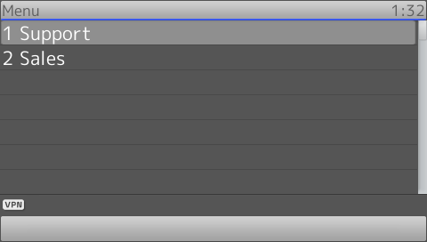

# SnomIPPhoneDirectory

!!! DANGER
    This tag will be deprectaed in future versions

!!! Demo
    [Try on your phone](xml/SnomIPPhoneDirectory.xml)

The **Telephone** tag content will be translated using the following rules:

* Whitespace character at the start and between characters will be translated to its URL-encoded form *%20*.
* If not written, *sip:* will be added at the start URI
* If user field contain number only and no domain defined, Registrar will be added as domain.
* If user field contain number only and ended with whitespace, *%20* will be added between the user field and *@* sign.
* If user field contain text or sign and no domain defined, no domain will be added.
* For more info about sip format, can be seen here [http://tools.ietf.org/html/rfc3261#section-19.1.1 RFC3261]

```
<Telephone>sip:123</Telephone> -> sip:123@abc.com
<Telephone>123</Telephone> -> sip:123@abc.com
<Telephone> 123</Telephone> -> sip:%20123@abc.com
<Telephone>123 </Telephone> -> sip:123%20@abc.com
<Telephone>def</Telephone> -> sip:def
<Telephone>def@home.com</Telephone> -> sip:def@home.com
<Telephone>def@home.com </Telephone> -> sip:def@home.com
<Telephone> def@home.com</Telephone> -> sip:%20def@home.com
```

```xml
{!docs/xml_minibrowser/examples/xml/SnomIPPhoneDirectory.xml!}
```

**Result**

