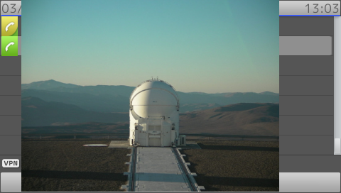

#SnomIPPhoneImageFile

!!! Demo
    [Try on your phone](xml/SnomIPPhoneImageFile.xml)

* The given image can only twice as big as the telephone resolution. as an example, for snom820 with resolution 320x240 can only show picture when its width lower than 640 and its height lower than 480
* If image width or height bigger than telephone resolution, then image is scaled until both width and height lower/equal to display resolution.
* Supported image extension are png,jpg,bmp
* Minibrowser also support transparency in png file

```xml
{!docs/xml_minibrowser/examples/xml/SnomIPPhoneImageFile.xml!}
```

**Result**

