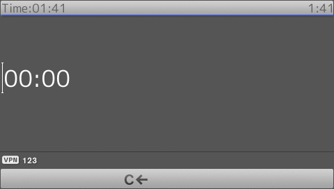

# SnomIPPhoneInput

!!! Demo
    [Try on your phone](xml/SnomIPPhoneInput.xml)

* Phone differentiate between two characters input by the time between the the release of the first key and press of the second key.
* The default value can bypass the input flag. This mean telephone can still send character even if the character can't be entered through phone keys. As example text as default value can still be send when number input flag is chosen.
* The default value will be directly replaced with ***** character on password and numeric password input flag. 
* If no input flag defined the normal text input flag will be chosen.
* You can define the character given from a key by changing these two setting, [chars in lower case](http://wiki.snom.com/Settings/chars_in_lower_case chars) and [chars in upper case setting](http://wiki.snom.com/Settings/chars_in_upper_case).
* Please note that, that the defined character(s) must be supported by the phone PUI language.

Example for URL tag:

```
<Url>http://example.com/example.php?myvar=__X__</Url>[...] <InputToken>__X__</InputToken>
<Url>http://example.com/example.php#var:foo=$$$BAR$$$</Url>[...]<InputToken>$$$BAR$$$</InputToken>
```

Input flag:

| Input flag | Input flag description |         Option to change input mode        | Default input mode | Long press of '*' key to change input mode |
|:-----------------------------------:|:------------------------------------------:|:------------------:|:------------------------------------------:|
|a           |normal text             |All modes are selectable and working        |lowercase           |changed and working                         |
|t           |telephone number        |All modes are selectable but not working    |number              |changed but not working                     |
|n           |number                  |no mode available                           |number              |changed but not working                     |
|e           |number with text        |All modes are selectable and working        |number              |changed and working                         |
|u           |uppercase text          |number mode is show but can't be chosen     |uppercase           |changed and working                         |
|l           |lowercase text          |uppercase mode is show but can't be chosen  |lowercase           |changed and working                         |
|p           |password                |All modes are selectable and working        |lowercase           |changed and working                         |
|pn          |nummeric password       |All modes are selectable and working        |number              |changed and working                         | 

!!! Info
    Avoid to input following sequence:
    
    * warm start: \*\*##
    * cold start: \*\*#\*
    * reset values: \* volume+ \* volume- \# (snom 3xx series only)

```xml
{!docs/xml_minibrowser/examples/xml/SnomIPPhoneInput.xml!}
```

**Result**


## InputMask

!!! Demo
    [Try on your phone](xml/InputMask.xml)

When using this tag you limit the position and input mode on this object. But at the same time this also limit characters *9*, *a* and *A*, which used to be mask.


```xml
{!docs/xml_minibrowser/examples/xml/InputMask.xml!}
```

**Result**

