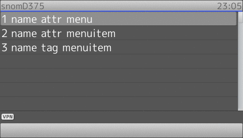
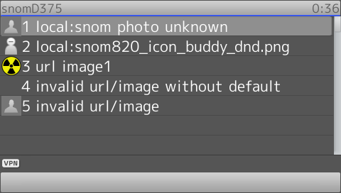
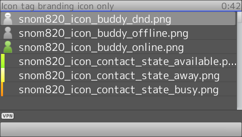

# SnomIPPhoneMenu

- Name Attribute in **Menu** and **MenuItem** is required.
- The speedselect method can be used to select/choose all available menu item

!!! Demo
    [Try on your phone](xml/SnomIPPhoneMenu.xml)

```xml
{!docs/xml_minibrowser/examples/xml/SnomIPPhoneMenu.xml!}
```

**Result**



## Image

!!! Warning
	This section refers to the **Image** tag used as a **MenuItem** subtag

!!! Demo
    [Try on your phone](xml/ImageMenu.xml)

* If no image is given as default, the icon on the left side of the text will be left blank (transparent).

```xml
{!docs/xml_minibrowser/examples/xml/ImageMenu.xml!}
```

**Result**



## Icon

!!! Demo
    [Try on your phone](xml/Icon.xml)

* All the snom phones with branding features can use internal icon on *file://snom/bmp/colored*. More available icon name can be found inside tar archive with file name prefix 'snom820_icon_' on branding instruction page.
* To use an external image use *Image* instead.

```xml
{!docs/xml_minibrowser/examples/xml/Icon.xml!}
```

**Results**

