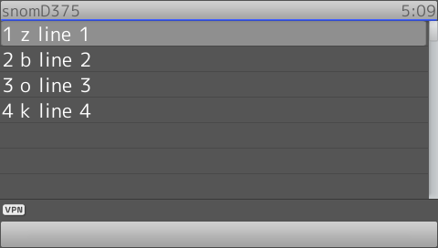

# Main Elements attributes

## selectable

!!! Demo
    [Try on your phone](xml/selectable.xml)

```xml
{!docs/xml_minibrowser/examples/xml/selectable.xml!}
```

## sort

!!! Demo
    [Try on your phone](xml/sort.xml)

```xml
{!docs/xml_minibrowser/examples/xml/sort.xml!}
```

**Result**



## state

!!! Demo
    [Try on your phone](xml/state.xml)

```xml
{!docs/xml_minibrowser/examples/xml/state.xml!}
```

!!! Info
    To test this scenario you can setup 2 cases:

    **Case 1**
    
    * Configure a function key as a speed dial to dial another extension
    * Activate this XML application
    * Press the speed dial after selecting a state

    **Case 2**
    
    * Call the phone from another phone
    * On the called phone activate this XML application
    * Press the *CANCEL* key after selecting a state