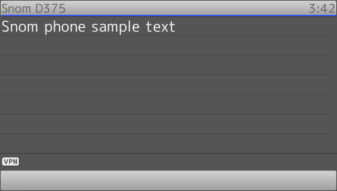
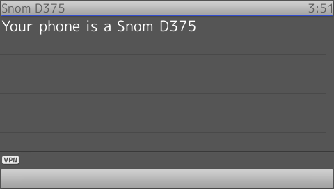
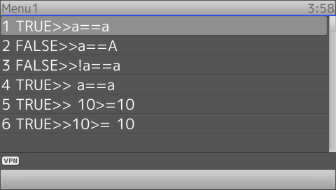
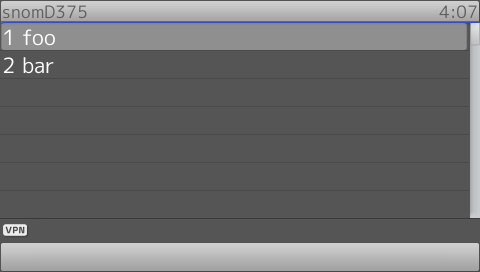
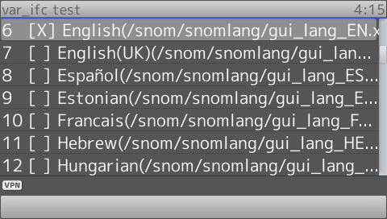
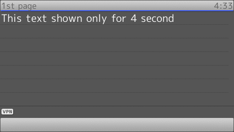

# Main Subelements examples

## Conditional blocks

The Snom Minibrowser supports also conditional code block that can be executed after a condition evaluation.
Conditional blocks are implemented trough the tags **If**, **Elif** and **Else**

!!! Demo
    * **Example1:** [Try on your phone](xml/Conditionals1.xml)
    * **Example2:** [Try on your phone](xml/Conditionals2.xml)
    * **Example3:** [Try on your phone](xml/Conditionals3.xml)

* These tags actually can be written almost anywhere (except as child tag of <Text>).
* The test in condition attribute are case sensitive.
* The white space will also be accounted comparison if exist on operand(s).
* Character or word(s) comparison can use only these operators *==* or *!=*. 
* Number comparison can use those operators and also these additional operators *>*, *<*, *>=*, *<=*.
* Using number comparison additional operators on alphabet or word(s) comparison will unexpected result.
* Write these operators *>=*, *<=*,*!=* in correct order.

### Conditionals example 1

Simple use of tags:

```xml
{!docs/xml_minibrowser/examples/xml/Conditionals1.xml!}
```

**Result**



### Conditionals example 2

Show different text on different Snom phone model:

```xml
{!docs/xml_minibrowser/examples/xml/Conditionals2.xml!}
```

**Result**



### Conditionals example 3

Test on some operators:

```xml
{!docs/xml_minibrowser/examples/xml/Conditionals3.xml!}
```

**Result**



## Repeat

It is recommended to use unique token. If one token contain another token this will create unexpected result.

!!! Warning
    * **Good tocken:** token="/\_\_NAME\_\_/\_\_URL\_\_/"
    * **Bad tocken:** token="/\_name\_/\_file_name\_/"

!!! Demo
    * **Example1:** [Try on your phone](xml/Repeat1.xml)
    * **Example2:** [Try on your phone](xml/Repeat2.xml)

### Repeat example 1

Example code using values attribute

```xml
{!docs/xml_minibrowser/examples/xml/Repeat1.xml!}
```

**Result**



### Repeat example 2

Example Code using *var_ifc* attribute

```xml
{!docs/xml_minibrowser/examples/xml/Repeat2.xml!}
```

**Result**



## Fetch

!!! Demo
    * [Try on your phone](xml/Fetch1.xml)

* Use 1 as value for the of mil attribute to make phone fetch the url as fast as possible
    * The real Minimum value for 'mil' attribute depend on phone type and file load time.
* Accuracy of fetch tag is also vary from phone type and file load time. Because of that, it is not recommended to use fetch tag to measure the time.
* **Fetch** with empty value will not load anything.

#### Fetch example, first page

```xml
{!docs/xml_minibrowser/examples/xml/Fetch1.xml!}
```

#### Fetch example, second page

```xml
{!docs/xml_minibrowser/examples/xml/Fetch2.xml!}
```

**Result**



## Led

!!! Demo
    [Try on your phone](xml/Led.xml)

* The changed led is not listed on phone *state_of_gui.htm* web page
* If led have only one colour, this will be triggered by any valid value from Led tag.
* Chassis led and line led have different behaviour based on value of led tag and value of color attribute 
* Led tag value of *redgreen* and *greenorange* can be activated if:
    * Led is multi color
    * value of type blink (*blink*, *blinkfast*, and *blinkslow* included)

#### Led example: led on

```xml
{!docs/xml_minibrowser/examples/xml/Led.xml!}
```

#### Led example: led off

```xml
{!docs/xml_minibrowser/examples/xml/Led-off.xml!}
```