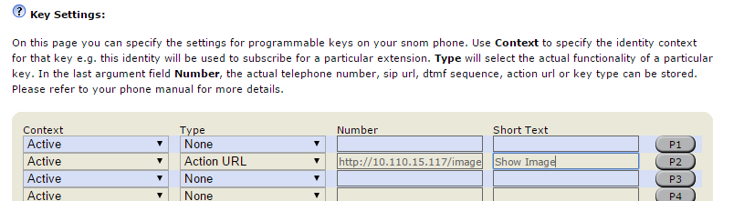
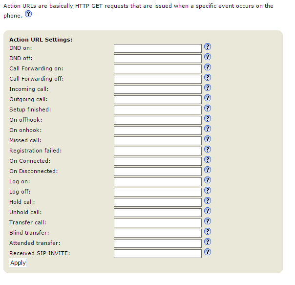

# Triggering an XML Minibrowser application

An XML application can be triggered in various way:

## Via Key pressure

The simplest way of showing a minibrowser page on the phone is to assign the page to a programmable function key using the **Action URL** key type.

Follow these steps to assign the page to a function key:

1. Open the web user interface of the phone in your browser (point the browser to *http://<ip_address_of_the_phone>/*)
1. Navigate to **Function keys**
1. For the key you want to change:
    1. Select **Type** = **Action URL**
    1. Insert the application URL into the **Number** textbox
    1. Provide a descriptive title in the **Short Text** field

    

Pressing the selected key now launches the minibrowser.

!!! Info:
    In case your application ins't triggered check the phone logs

## Via Action URLs triggers

Using the **Action URL** feature the phone can trigger an HTTP request when a specific event occours on the phone:



You can just provide the minibrowser URL to be launched for each specific event and click "Apply". In this case the page is launched whenever the event occurs. E.g. if you provide **http://someurl/somepage.xml** in the **DND on** field each time you enable the DND feature on the phone this URL will be called.

!!! Info:
    Action URLs do not necessarily need to show up on the phone. If you point to a URL which does not return an XML body in its 200 Ok response then the phone will not display anything.

### Adding information to an Action URL

Sometimes you want to provide additional information in the URL (e.g. the Caller ID for an incoming call, the MAC address of the phone or the value of a specific setting).

#### Runtime variables

Runtime variables are filled in at the time when the event was triggered. The following table describes the available variables:

| Variable name | Description |
|---------------|-------------|
| *$local* | The local SIP URI of the call |
| *$remote* | The remote SIP URI of the call |
| *$active_url* | The SIP URI of the active outgoing identity |
| *$active_user* | The user part of the SIP URI for the active outgoing identity |
| *$active_host* | The host part of the SIP URI for the active outgoing identity |
| *$csta_id | CSTA ID |
| *$call-id* | The call-id of the active call |
| *$display_local* | Used to display the name of callee |
| *$display_remote* | Used to display the name of caller|
| *$expansion_module* | Indicated the expansion module being used
| *$active_key* | The Function Key (e.g. P1, P5, P32,..) associated with a call|
| *$phone_ip* | The current ip address of the phone |
| *$nr_ongoing_calls* | Contains the number of currently active calls| 
| *$context_url* | Used in log_on/off-action to provide the sip-uri of the logged-on/off identity |
| *$cancel_reason* | When a call has been canceled/terminated via sip-cancel this will paste the content of the reason-header |

!!! Warning:
    Not all of the above runtime variables are used for all events.

So if you would like to insert the local and remote uris in your URL it needs to look as follows:
*http://my.server.com/minibrowser.xml?local=$local&remote=$remote*

#### Inserting setting values

In some cases you would like to access current setting values in the scripts generating your content (you can use the [set](examples/cb_set.md) callback in your minibrowser XMLs to access setting values without passing them in the URL). In these cases you can just use the setting name prepended by a *$*-sign.

**Example:**

- *http://my.server.com/minibrowser.php?language=$language*
- *http://my.server.com/minibrowser.php?hostname=$user_host1* (for identity settings append the identity number - in this case 1)

!!! WARNING:
    Please note that - due to security constraints passwords and password-like settings cannot be referenced like this.

#### Launch the minibrowser using a HTTP GET request to the phone

Another commonly used way to trigger the minibrowser is to use HTTP GET requests to the phone page called *minibrowser.htm*.

**Example:**

*http://10.110.15.51/minibrowser.htm?url=http://10.110.15.117/launch.xml*

!!! Info:
    You have to make sure that the URL you provide in the url-parameter is properly encoded:
    
    *http://phone_ip/minibrowser.htm?url=http://IPADDRESS/menu.xml?mac=MAC&check=1234&type=4*
    
    Needs to be encoded like this:

    *http://phone_ip/minibrowser.htm?url=http://IPADDRESS%2Fmenu.xml%3Fmac%3DMAC%26check%3D1234%26type%3D*
    
    [here](https://en.wikipedia.org/wiki/Percent-encoding) you can find more informations about the "percent encoding". [This](http://www.url-encode-decode.com/) website provides a free encoder / decoder.

## Via SIP NOTIFY request

An XML application can be also sent to the phone via a SIP request, this requires some setup on the phone.

Please configure the following settings:

| Setting Name | Value | Description |
|--------------|-------|-------------|
| *xml_notify* | on | This setting is required to enable this feature |
| *filter_registrar* | off | This setting should be **off** in case you are sending the request from an IP different that your PBX |
| *network_id_port* | 5060 | This setting is needed if you don't know the ephemeral port used for SIP by the phone |
| *offer_gruu* | off | This setting can stay **on** if you are sending the request from the PBX and the PBX supports GRUU |
| *user_sipusername_as_line* | off | This setting can stay **on** if you are sending the request from the PBX and the PBX sends the request to the proper SIP URI |

**Example:**

Assume we use the workstation at IP address 10.0.5.30 to send XML content to a snom375 phone at 10.0.5.174 which has identity 440 registered

```
NOTIFY sip:10.0.0.174:5060 SIP/2.0
Via: SIP/2.0/UDP 10.0.5.30:1036
From: <sip:sipsak@10.0.5.30>;tag=2502
To: <sip:440@10.0.0.174>;tag=2502
Call-ID: fakeCall-ID@me
CSeq: 1 NOTIFY
Max-Forwards: 70
Event: xml
Subscription-State: active;expires=30000
Content-Type: application/snomxml
Content-Length: 317
<?xml version="1.0" encoding="UTF-8"?>
<SnomIPPhoneDirectory>
<Title>Menutitle</Title>
<Prompt>Prompt</Prompt>
<DirectoryEntry>
<Name>John</Name>
<Telephone>123456789</Telephone>
</DirectoryEntry>
<DirectoryEntry>
<Name>Doe</Name>
<Telephone>987654321</Telephone>
</DirectoryEntry>
</SnomIPPhoneDirectory>
```

!!! Warning:
    The *Content-Length* header must have the correct value and the headers:
    
    * **Event: xml**
    * **Content-Type: application/snomxml**
    
    are mandatory for this feature

!!! Info:
    In order to send the SIP request you can use [sipsack](https://sourceforge.net/projects/sipsak.berlios/) or [SIPPing](https://github.com/pbertera/SIPPing).
